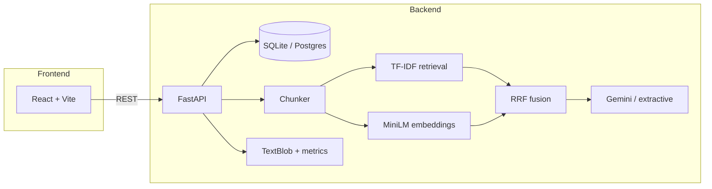

# MindForge

**Local NLP + RAG document intelligence** — upload text, run analysis (summary, sentiment, keywords), and chat over hybrid retrieval. Generation uses a free Gemini/Groq API (or extractive fallback); no OpenAI.

**Live demo:** [mind-forge-phi.vercel.app](https://mind-forge-phi.vercel.app) · [API docs](https://mindforge-api-zixn.onrender.com/docs)

---

## What it does

MindForge is a full-stack **retrieval-augmented generation (RAG)** app:

| ML/NLP component | Implementation |
| ---------------- | -------------- |
| Document chunking | Paragraph-aware splitting with overlap |
| Lexical retrieval | TF-IDF + cosine similarity (scikit-learn) |
| Dense retrieval | `all-MiniLM-L6-v2` sentence embeddings (optional) |
| Vector store | ChromaDB — embeddings persisted at index time |
| Hybrid fusion | Reciprocal Rank Fusion (RRF) of TF-IDF + dense scores |
| Analysis | TextBlob sentiment, TF-IDF keywords, readability metrics |
| Generation | Gemini / Groq over retrieved chunks (extractive fallback) |

---

## Architecture



**Chat flow:** User question → retrieve top excerpts (hybrid or TF-IDF) → Gemini/Groq generates an answer from those chunks (falls back to extractive ranking if no key or the API fails).

---

## Stack

| Layer | Tech |
| ----- | ---- |
| Backend | Python 3.12, FastAPI, SQLAlchemy, SQLite / PostgreSQL |
| Auth | JWT (register / login), bcrypt password hashing |
| ML/NLP | scikit-learn, TextBlob, sentence-transformers (optional) |
| Frontend | React 19, TypeScript, Vite |
| Deploy | Render (API), Vercel (UI) |

---

## Quick start

### 1. Backend

```bash
cd backend
python -m venv .venv

# Windows
.venv\Scripts\activate

# macOS/Linux
# source .venv/bin/activate

pip install -r requirements.txt
pip install -r requirements-ml.txt   # hybrid RAG with MiniLM (recommended)
python -m textblob.download_corpora
```

Copy `backend/.env.example` to `backend/.env`. For LLM chat answers, set `LLM_PROVIDER=gemini` and a free `GEMINI_API_KEY` from [aistudio.google.com/apikey](https://aistudio.google.com/apikey). Without a key, chat still works in extractive mode.

**Windows (recommended):**

```powershell
.\run.ps1
```

**Or manually** (avoid `--reload` on Windows/OneDrive):

```bash
uvicorn app.main:app --port 8000
```

API: http://127.0.0.1:8000/docs · Health: http://127.0.0.1:8000/api/health

Database: `%LOCALAPPDATA%\MindForge\mindforge.db` (outside OneDrive to avoid locks).

### 2. Frontend

```bash
cd frontend
npm install
npm run dev
```

Open http://localhost:5173

Check the header badge: **RAG · Hybrid (TF-IDF + MiniLM)** means embeddings are active; **LLM · gemini** means generation is enabled.

---

## Configuration

| Variable | Default | Description |
| -------- | ------- | ----------- |
| `CORS_ORIGINS` | localhost:5173 | Comma-separated allowed origins |
| `DATABASE_URL` | LOCALAPPDATA path | SQLite (local) or PostgreSQL URL (production) |
| `JWT_SECRET` | (dev default) | **Required in production** — random secret for tokens |
| `JWT_EXPIRE_HOURS` | `72` | Token lifetime |
| `USE_EMBEDDING_RAG` | `true` | Set `false` on low-memory deploy (TF-IDF only) |
| `USE_VECTOR_STORE` | `true` | ChromaDB for stored embeddings (local); `false` on Render |
| `LLM_PROVIDER` | `local` | `gemini` (recommended), `groq`, `ollama`, or `local` |
| `GEMINI_API_KEY` | (empty) | Free key from [aistudio.google.com/apikey](https://aistudio.google.com/apikey) |
| `GEMINI_MODEL` | `gemini-2.5-flash` | Gemini model for chat generation |
| `GROQ_API_KEY` | (empty) | Groq API key (if using `groq`) |
| `GROQ_MODEL` | `llama-3.1-8b-instant` | Groq model name |
| `OLLAMA_BASE_URL` | `http://127.0.0.1:11434` | Local Ollama only (not for Render) |
| `OLLAMA_MODEL` | `llama3.2` | Ollama model name |

### LLM (free RAG generation)

| Where | Setup |
| ----- | ----- |
| **Local** | `LLM_PROVIDER=gemini` + `GEMINI_API_KEY` in `backend/.env` |
| **Render (web)** | Same vars in Render **Environment** → redeploy backend |
| **Ollama** | Local dev only — cannot run on Render free tier |

Chat flow: retrieve chunks → **Gemini generates answer** (falls back to extractive if key missing or API fails).

---

## Deployment (persistent data)

| Service | URL |
| ------- | ---- |
| Frontend | https://mind-forge-phi.vercel.app |
| Backend | https://mindforge-api-zixn.onrender.com |

### 1. Create Render PostgreSQL (free tier)

1. Render Dashboard → **New** → **PostgreSQL**
2. Copy the **Internal Database URL** (starts with `postgresql://`)

### 2. Render web service env vars

```
PYTHON_VERSION=3.12.7
DATABASE_URL=<paste Render Postgres URL>
JWT_SECRET=<long random string>
CORS_ORIGINS=https://mind-forge-phi.vercel.app

# Low-memory free tier: disk is wiped on restart, so disable disk-based RAG
USE_EMBEDDING_RAG=false
USE_VECTOR_STORE=false

# Free LLM for RAG chat (Gemini hosts the model — no GPU/disk needed on Render)
LLM_PROVIDER=gemini
GEMINI_API_KEY=<paste from aistudio.google.com/apikey>
GEMINI_MODEL=gemini-2.5-flash
```

**Build command:** `pip install -r requirements.txt`  
**Start command:** `uvicorn app.main:app --host 0.0.0.0 --port $PORT`  
**Root directory:** `backend`

> On the free tier, install only `requirements.txt` (NOT `requirements-ml.txt`).  
> `sentence-transformers` + `chromadb` need too much RAM/disk, so the app  
> automatically runs **TF-IDF retrieval + Gemini generation** there.

1. Render Dashboard → your **mindforge-api** web service → **Environment**
2. Add each variable above (or edit existing ones)
3. **Save** — Render redeploys automatically

After deploy, open `https://mindforge-api-zixn.onrender.com/api/health` and check:

```json
"ai_provider": "gemini",
"features": { "llm_enabled": true, "llm_provider": "gemini", "vector_store": false }
```

The Vercel UI header should show **LLM · gemini** when chat uses the deployed API.

### 3. Vercel

Root directory: `frontend`. API proxied via `frontend/vercel.json` → Render backend.

No extra Vercel env vars needed for LLM — Gemini runs from the **Render backend** only.

Tables are created automatically on first backend startup.

> **Do not use** `sqlite+aiosqlite:///./mindforge.db` on Render — that disk is temporary and data is lost on restart. Use PostgreSQL.

### What runs where

| Component | Local | Render (free tier) |
| --------- | ----- | ------------------ |
| Database | SQLite (your disk) | PostgreSQL (persistent) |
| Dense retrieval | MiniLM embeddings | off (TF-IDF only) |
| Vector store | ChromaDB (your disk) | off (no persistent disk) |
| Generation | Gemini LLM | Gemini LLM |

---

## Project structure

```
project/
├── backend/
│   ├── app/
│   │   ├── main.py
│   │   ├── routers/
│   │   └── services/
│   │       ├── rag.py             # TF-IDF + hybrid orchestration
│   │       ├── embedding_rag.py   # MiniLM + RRF
│   │       ├── vector_store.py    # ChromaDB persistence
│   │       ├── indexing.py        # Chunk + index pipeline
│   │       ├── llm.py             # Gemini / Groq / Ollama
│   │       ├── local_ai.py        # Analysis + extractive chat
│   │       └── metrics.py
│   ├── requirements.txt
│   ├── requirements-ml.txt        # sentence-transformers + chromadb
│   ├── .env.example
│   └── run.ps1
└── frontend/
    ├── src/
    └── vercel.json
```

---

## API endpoints

| Method | Path | Description |
| ------ | ---- | ----------- |
| GET | `/api/health` | Status, retrieval mode, feature flags |
| POST | `/api/auth/register` | Create account |
| POST | `/api/auth/login` | Log in, get JWT |
| GET | `/api/auth/me` | Current user (requires auth) |
| GET | `/api/documents` | List your documents |
| POST | `/api/documents` | Create document |
| POST | `/api/documents/upload` | Upload .txt / .md / .csv |
| GET | `/api/documents/{id}` | Get one document |
| POST | `/api/documents/{id}/index` | Re-index chunks / embeddings |
| POST | `/api/documents/{id}/analyze` | Run NLP analysis |
| GET | `/api/documents/{id}/analyses` | Analysis history |
| POST | `/api/documents/{id}/chat` | RAG chat |
| GET | `/api/documents/{id}/messages` | Chat history |
| DELETE | `/api/documents/{id}/messages` | Clear chat history |
| DELETE | `/api/documents/{id}` | Delete document |

All `/api/documents/*` and `/api/auth/me` routes require `Authorization: Bearer <token>`.

---

## License

MIT
