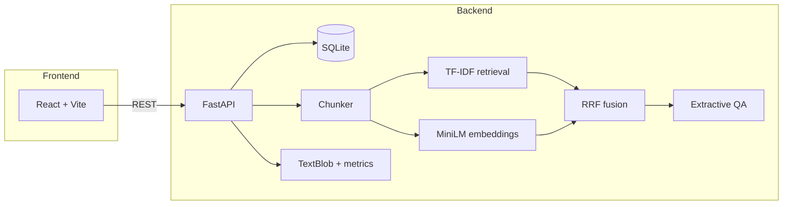

# MindForge

**Local NLP + RAG document intelligence** — upload text, run analysis (summary, sentiment, keywords), and chat with hybrid retrieval. No OpenAI or API keys.

**Live demo:** [mind-forge-phi.vercel.app](https://mind-forge-phi.vercel.app) · [API docs](https://mindforge-api-zixn.onrender.com/docs)

---

## Why this project (for ML roles)

MindForge is a full-stack **retrieval-augmented generation (RAG)** app built from scratch:

| ML/NLP component | Implementation |
| ---------------- | -------------- |
| Document chunking | Paragraph-aware splitting with overlap |
| Lexical retrieval | TF-IDF + cosine similarity (scikit-learn) |
| Dense retrieval | `all-MiniLM-L6-v2` sentence embeddings (optional) |
| Hybrid fusion | Reciprocal Rank Fusion (RRF) of TF-IDF + dense scores |
| Analysis | TextBlob sentiment, TF-IDF keywords, readability metrics |
| Generation | Extractive QA over retrieved chunks (local, no LLM API) |

**Resume bullets (copy-paste):**

- Built a full-stack document intelligence app with **hybrid RAG** (TF-IDF + MiniLM embeddings + RRF fusion) for contextual Q&A over user documents.
- Implemented an end-to-end **NLP pipeline**: chunking → dual retrieval → relevance scoring → extractive answer generation; deployed FastAPI backend + React frontend.

**Interview talking points:**

1. *Why hybrid RAG?* TF-IDF catches exact terms; embeddings catch paraphrases. RRF merges ranked lists without tuning weights.
2. *Why local?* Reproducible, no API cost, runs offline — good for demos and privacy-sensitive docs.
3. *Trade-offs:* Production deploy uses TF-IDF only on low-memory hosts; full hybrid runs locally with `requirements-ml.txt`.

---

## Architecture



**Chat flow:** User question → chunk document → retrieve top-5 excerpts (hybrid or TF-IDF) → rank sentences in excerpts → compose answer with relevance scores.

---

## Stack

| Layer | Tech |
| ----- | ---- |
| Backend | Python 3.12, FastAPI, SQLAlchemy, SQLite |
| ML/NLP | scikit-learn, TextBlob, sentence-transformers (optional) |
| Frontend | React 19, TypeScript, Vite |
| Deploy | Render (API), Vercel (UI) |

---

## Quick start

### 1. Backend

```bash
cd backend
python -m venv .venv

# Windows
.venv\Scripts\activate

# macOS/Linux
# source .venv/bin/activate

pip install -r requirements.txt
pip install -r requirements-ml.txt   # hybrid RAG with MiniLM (recommended)
python -m textblob.download_corpora
```

**Windows (recommended):**

```powershell
.\run.ps1
```

**Or manually** (avoid `--reload` on Windows/OneDrive):

```bash
uvicorn app.main:app --port 8000
```

API: http://127.0.0.1:8000/docs · Health: http://127.0.0.1:8000/api/health

Database: `%LOCALAPPDATA%\MindForge\mindforge.db` (outside OneDrive to avoid locks).

### 2. Frontend

```bash
cd frontend
npm install
npm run dev
```

Open http://localhost:5173

Check the header badge: **RAG · Hybrid (TF-IDF + MiniLM)** means embeddings are active.

---

## Configuration

| Variable | Default | Description |
| -------- | ------- | ----------- |
| `CORS_ORIGINS` | localhost:5173 | Comma-separated allowed origins |
| `DATABASE_URL` | LOCALAPPDATA path | SQLite connection string |
| `USE_EMBEDDING_RAG` | `true` | Set `false` on low-memory deploy (TF-IDF only) |

Copy `backend/.env.example` to `backend/.env` and adjust as needed.

---

## Deployment

| Service | URL |
| ------- | --- |
| Frontend | https://mind-forge-phi.vercel.app |
| Backend | https://mindforge-api-zixn.onrender.com |

**Render env vars:**

```
PYTHON_VERSION=3.12.7
DATABASE_URL=sqlite+aiosqlite:///./mindforge.db
CORS_ORIGINS=https://mind-forge-phi.vercel.app
USE_EMBEDDING_RAG=false
```

**Vercel:** root directory `frontend`. API proxied via `frontend/vercel.json` → Render backend.

---

## Project structure

```
project/
├── backend/
│   ├── app/
│   │   ├── main.py
│   │   ├── routers/
│   │   └── services/
│   │       ├── rag.py           # TF-IDF + hybrid orchestration
│   │       ├── embedding_rag.py # MiniLM + RRF
│   │       ├── local_ai.py      # analysis + extractive chat
│   │       └── ai.py
│   ├── requirements.txt
│   ├── requirements-ml.txt      # sentence-transformers
│   └── run.ps1
└── frontend/
    ├── src/
    └── vercel.json
```

---

## API endpoints

| Method | Path | Description |
| ------ | ---- | ----------- |
| GET | `/api/health` | Status, retrieval mode, feature flags |
| GET | `/api/documents` | List documents |
| POST | `/api/documents` | Create document |
| POST | `/api/documents/upload` | Upload .txt / .md / .csv |
| POST | `/api/documents/{id}/analyze` | Run NLP analysis |
| POST | `/api/documents/{id}/chat` | RAG chat |
| DELETE | `/api/documents/{id}/messages` | Clear chat history |
| DELETE | `/api/documents/{id}` | Delete document |

---

## GitHub profile tips

Add to repo **About**: `nlp`, `rag`, `machine-learning`, `fastapi`, `react`, `sentence-transformers`

Pin this repo. Link the live demo in your resume and LinkedIn.

---

## License

MIT
